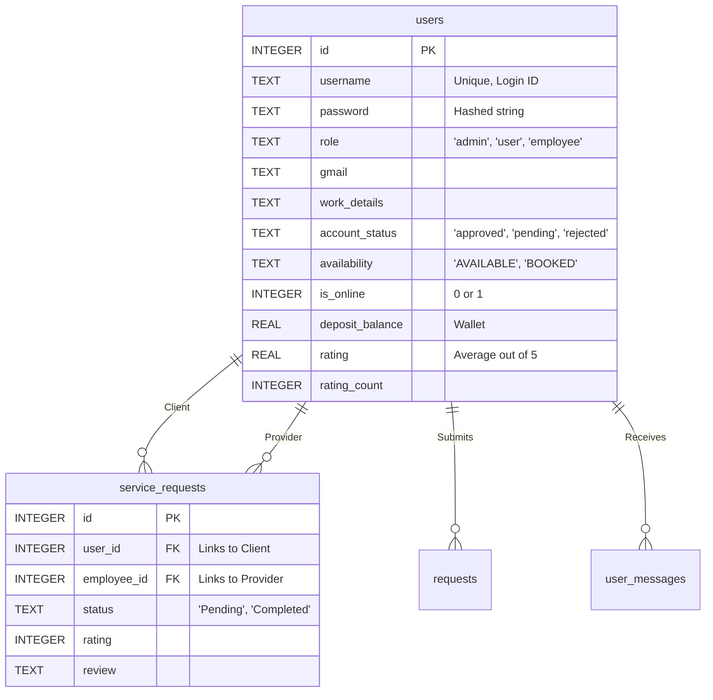

# Rent Hub 🏢 - Comprehensive Project Overview

Welcome to the **Rent Hub** repository! This document serves as a massive, pin-to-pin summary of the entire project. Whether you are a developer looking to understand the architecture, or a system administrator deploying the application, this guide contains every detail you need.

---

## 1. Executive Summary & Value Proposition

**Rent Hub** is a robust, dynamic web application designed to bridge the gap between clients needing services (Users) and registered professionals offering those services (Employees). Built on the **Flask** microframework, the platform operates as a centralized hub for discovering services, communicating, securely booking jobs, and processing payments. 

The application utilizes a sleek, modern **Glassmorphism** UI, ensuring a premium user experience across all distinct role-based dashboards.

---

## 2. Comprehensive Feature Breakdown

The application strictly enforces Role-Based Access Control (RBAC). Features are isolated based on the authenticated user's role.

### 👑 Admin Privileges (`dashboard_admin.html`)
*   **Employee Application Management**: Admins review pending employee applications. They can approve or reject them. Upon approval, the system auto-generates a secure password and emails it to the employee via SMTP.
*   **System Oversight**: View all registered users and all active/blocked employees in tabular formats.
*   **Profile Management**: Admins can update their own profile details (username, email, password, etc.).
*   **Metrics & Analytics**: See who is currently online (`is_online` status) and view top-rated employees.

### 👤 User/Client Features (`dashboard_user.html`)
*   **Service Discovery**: Search for specific service categories (e.g., plumbing, cleaning) and view a ranked list of available professionals.
*   **Booking System**: Initiate service requests with specific employees. Track active rentals/services and view total lifetime bookings.
*   **Digital Wallet (Razorpay)**: Deposit funds directly into their platform account using the integrated Razorpay checkout system.
*   **Review & Rating System**: Rate completed jobs on a 1-5 scale and leave written reviews, directly impacting the employee's global rating.
*   **Messaging**: View system notifications and messages sent directly to their user account.

### 💼 Employee/Provider Features (`dashboard_employee.html`)
*   **Job Management**: View incoming service requests from users. Track the status of jobs assigned to them.
*   **Dynamic Availability**: Toggle their current working status (`AVAILABLE`, `NOT AVAILABLE`, `BOOKED`), which dictates whether users can book them.
*   **Earnings & Ratings Tracking**: Monitor their average rating and total completed jobs.
*   **Direct Inquiries**: Receive and view direct messages tied to their registered email address (even from non-authenticated sources/contact forms).

---

## 3. Application Architecture & Workflows

### Authentication Flow
1. **Registration**: 
   - Users register instantly and are logged into their dashboard. 
   - Employees apply and wait in a `pending` state.
2. **Approval (Employees only)**: Admin clicks 'Accept'. The server uses `generate_password_hash()` for a random 8-character string, updates the DB, and fires `send_employee_credentials()` using `Flask-Mail`.
3. **Login**: Checks DB for matching username/role and validates the hash. Updates `is_online = 1` and creates a secure, HttpOnly Flask `session`.

### Payment Flow (User Deposit)
1. User enters deposit amount on their dashboard.
2. The `/user_add_deposit` route contacts the Razorpay API using server-side keys (`RAZORPAY_KEY_ID`, `RAZORPAY_KEY_SECRET`).
3. An Order ID is generated and passed to `payment.html`.
4. The client-side Razorpay checkout script renders the UI.
5. Upon success, Razorpay captures the payment.

---

## 4. Complete Database Schema (SQLite 3)

The application uses a relational database generated by `init_db.py`.



### Table Definitions
1.  **`users`**: The central entity. Handles login credentials, role assignments, financial balances, and profile states.
2.  **`service_requests`**: The core transactional table linking a user to an employee for a specific job.
3.  **`requests`**: Handles generic item/service requests that are not yet assigned to a specific employee.
4.  **`user_messages`**: Internal notifications targeted at specific `user_id`s.
5.  **`employee_messages`**: Contact messages targeted at specific `gmail` addresses (useful for external inquiries).

---

## 5. System Routes (API & Endpoints)

Here is a pin-to-pin breakdown of the primary routes defined in `app.py`:

**Public / Auth Routes:**
- `@app.route("/")` - Renders the main landing page (`index.html`).
- `@app.route("/login")` - Global POST route to handle logins.
- `@app.route("/admin", "/user", "/employee")` - Role-specific login portals.
- `@app.route("/register_user")` - Creates a new client account.
- `@app.route("/register_employee")` - Submits a new provider application.
- `@app.route("/logout")` - Clears session and sets `is_online = 0`.

**Dashboards (Protected):**
- `@app.route("/dashboard_admin")` - Renders Admin view (requires `admin` role).
- `@app.route("/dashboard_user")` - Renders User view (requires `user` role).
- `@app.route("/dashboard_employee")` - Renders Employee view (requires `employee` role).

**User Actions:**
- `@app.route("/view_service/<path:service_name>")` - Fetches employees matching a service string.
- `@app.route("/user_employee_details/<int:emp_id>")` - Displays full profile of an employee.
- `@app.route("/rate_profile/<int:emp_id>")` - POST route to submit a 1-5 rating. Updates running average in the `users` table.
- `@app.route("/user_add_deposit")` - Initiates Razorpay order creation.

**Employee Actions:**
- `@app.route("/api/employee_messages")` - JSON endpoint returning messages tied to the employee's Gmail.
- `@app.route("/update_employee_availability")` - Updates working status.

**Profile Updates:**
- `@app.route("/update_employee", "/update_admin", "/update_user")` - Form handlers for editing profile details.

**Admin Actions:**
- `@app.route("/admin_accept_employee/<int:emp_id>")` - Approves application, generates PW, sends email.
- `@app.route("/admin_reject_employee/<int:emp_id>")` - Rejects application.

---

## 6. Technology Stack Deep Dive

1. **Python / Flask**: The backbone of the application. `Flask-Session` is used for persistent logins. `functools.wraps` is used to create custom `@login_required` decorators.
2. **SQLite 3**: Native Python database. Connections use `sqlite3.Row` factory to allow dictionary-like column access in Python.
3. **Razorpay**: Python SDK (`razorpay`) used server-side to generate order IDs, paired with client-side JS checkout forms.
4. **Flask-Mail & smtplib**: Configured with `smtp.gmail.com` on port 587 (TLS) for sending automated platform emails.
5. **Security Suite**: 
   - `werkzeug.security`: `generate_password_hash` / `check_password_hash`.
   - `Flask-WTF`: `CSRFProtect` active globally.

---

## 7. Setup & Installation Guide

Follow these instructions pin-to-pin to get the server running.

### Prerequisites
*   Python 3.8+ installed.
*   A Gmail account with an "App Password" generated for SMTP access.
*   A Razorpay Developer account with API keys.

### Step-by-Step Installation

1. **Clone & Install Dependencies**
   ```bash
   pip install -r requirements.txt
   ```
   *(Required: Flask, Werkzeug, Flask-Mail, Razorpay, python-dotenv, flask-wtf, itsdangerous)*

2. **Configure Environment Variables**
   Create a `.env` file in the root directory:
   ```env
   # Mandatory application secret for sessions and CSRF
   SECRET_KEY=your_super_secret_random_string

   # Gmail SMTP Configuration
   MAIL_SENDER=your_email@gmail.com
   MAIL_PASSWORD=your_google_app_password

   # Razorpay API Keys
   RAZORPAY_KEY_ID=your_razorpay_key_id
   RAZORPAY_KEY_SECRET=your_razorpay_key_secret
   ```

3. **Initialize the Database**
   This script drops existing tables (if any) and creates fresh ones, seeding the master admin account.
   ```bash
   python init_db.py
   ```
   *Default Admin:* `admin_user` / `admin123`

4. **Launch the Server**
   ```bash
   python app.py
   ```
   The server will start on `http://127.0.0.1:5000/`.

---

## 8. Complete Project File Structure

```text
rent_hub/
│
├── app.py                     # The core Flask application (routing, business logic, email integration)
├── init_db.py                 # SQLite schema definition and initial data seeding
├── requirements.txt           # Pip dependencies list
├── database.db                # Auto-generated SQLite database
├── .env                       # Local environment variables (do not commit to version control)
│
├── static/                    # Public static assets
│   ├── css/                   # Stylesheets
│   │   └── style.css          # Core CSS (Glassmorphism UI tokens, Flexbox layouts)
│   ├── js/                    # Client-side JavaScript
│   │   └── script.js          # Interactive UI logic, modals, DOM manipulation
│   └── images/                # App icons, background images, default avatars
│
└── templates/                 # Jinja2 HTML Templates
    ├── index.html             # The public landing page
    ├── admin_login.html       # Auth portal for admins
    ├── user_login.html        # Auth portal for clients
    ├── employee_login.html    # Auth portal for providers
    ├── dashboard_admin.html   # Main admin command center
    ├── dashboard_user.html    # Client hub (bookings, wallet, searches)
    ├── dashboard_employee.html# Provider hub (jobs, availability)
    ├── service_providers.html # Search results listing professionals
    ├── payment.html           # Razorpay checkout wrapper
    ├── user_employee_details.html # Detailed view of a provider's profile
    ├── admin_user_details.html    # Detailed view of a user profile (for admins)
    ├── forgot_password.html   # Password recovery flow (UI)
    └── reset_password.html    # Password reset flow (UI)
```

---
*Document designed to serve as the ultimate reference for the Rent Hub project architecture and functionality.*
